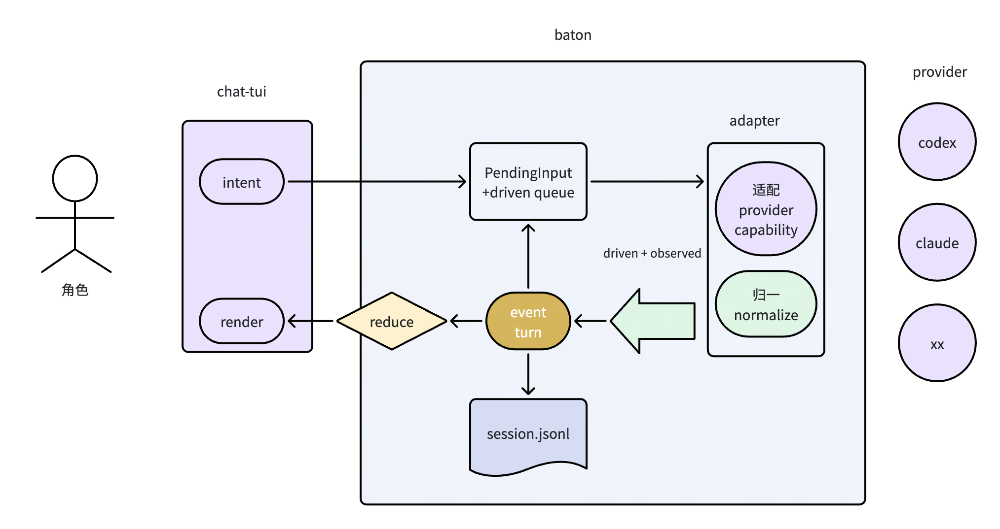

# baton

[English](README.md) | [简体中文](README.zh-CN.md)

> Pass context between coding agents like a baton.

baton is a terminal-native coding-agent session, inspired by [tutti](https://github.com/tutti-os/tutti). A BatonSession remains the same durable conversation while you switch providers with `/codex` or `/claude`, including after closing and reopening baton. Claude Code and Codex are the first bundled providers, not a closed support list.

Provider-native sessions are resume optimizations; BatonSession history remains available even when a native session cannot be resumed.

## Philosophy

The most common shape of multi-agent work today is a human acting as a context courier: copying one agent's output to another, re-explaining background, hand-writing handoff documents. baton wants context to be **an asset the user owns**, not a by-product locked inside a single tool.

Two fundamentals are in place today:

- **Context portability**: a BatonSession is a durable, unified history owned by the user that outlives any single provider. Switching agents requires no context carrying; provider-native sessions only accelerate resume and are never a prerequisite for the history to survive.
- **Native experience**: baton preserves each agent's own input, completion, streaming, tool-call, and approval experience as much as possible, adding only a few commands of its own (such as `/codex` and `/claude`).

On top of these, three directions are on the roadmap (**none implemented yet**):

- **Multi-provider collaboration**: from relaying within one session toward dispatching the same task to multiple providers in parallel, with results merged back into one unified history. The near-term path is draft sessions — when a new idea strikes mid-task, fork a draft session (optionally on a different provider) to explore in parallel without interrupting the mainline.
- **Context intake**: the mainline is not a raw transcript of everything but the canonical history the user endorses. After a draft session produces results, the user decides whether to merge its conclusions into the mainline or discard them; discarding is not deletion — drafts stay durable and referenceable.
- **Event-driven long-running loops**: listen to external events such as pushed commits or merged PRs and wake the corresponding session to continue its work, so agents are no longer confined to an interactive terminal.

## Architecture at a glance

baton is one bidirectional pipeline: chat-tui carries `intent`/`render` only, the runtime owns `PendingInput` + the driven-turn queue, adapters translate each provider's wire to a single normalized event stream, and `session.jsonl` persists it. The event stream is the sole source of truth; the UI is a projection.



See [`docs/kernel.md`](docs/kernel.md) for the stable kernel — core concepts, invariants, the pipeline, and the provider extension contract.

## Features

- Use Claude Code and Codex from the same terminal interface
- Switch directly with `/codex` or `/claude`, and configure the active provider with `/model`
- Open a previous BatonSession with `/sessions`, or start a clean one with `/new`
- Continue the latest session in a project with `baton -c`, or open one by ID with `baton -s <id>`
- Reference previous sessions with `@<session-id>` and inject a compact summary automatically
- Record messages, thoughts, tool calls, file changes, plans, and token usage in a unified format
- Append events to a local `session.jsonl` for state reconstruction and future references
- Reuse local Claude Code and Codex credentials without storing them in baton
- Use a headless REPL to debug agent integrations

## Installation & configuration

Install baton with npm. You also need at least one supported agent installed and authenticated ([Codex CLI](https://github.com/openai/codex) / [Claude Code](https://docs.anthropic.com/en/docs/claude-code/overview)).

```bash
npm install -g @qiankun01/baton
```

Or run it once without a global install:

```bash
npx @qiankun01/baton
```

On first run, baton creates `~/.baton/config.yaml`:

```yaml
defaultAgent: codex
codexCommand:
  - codex
  - app-server
codexApprovalReviewer: user
mentionBudgetChars: 4096
showThoughts: true
```

See [`config.yaml.example`](config.yaml.example) for all available options and usage notes.

Set `codexApprovalReviewer: auto_review` to delegate Codex approvals to its risk reviewer. Baton keeps the delegation visible in Agent Status and records each automatic decision beside its target tool; the default `user` keeps interactive approval cards in Baton.

If Claude Code uses a custom executable, set `claudeExecutable` in the configuration or override it temporarily with an environment variable (`BATON_CLAUDE_BIN=/path/to/claude baton`). Configuration precedence: environment variables > `config.yaml` > defaults.

## Usage

Start the TUI and type a prompt to send it.

```text
/claude or /cc       Switch to Claude Code
/codex or /cx        Switch to Codex
/cc <message>        Switch to Claude Code and send the message immediately
/cx <message>        Switch to Codex and send the message immediately
/cla <message>       Unique provider-name prefixes work too
/model               Open the model picker for the active provider
/model <id>          Select the model used by subsequent turns
/sessions            Open the BatonSession picker
/new                 Start a new BatonSession in the current project
@bs_...               Reference another baton session
Tab                   Complete a command or reference
Esc                   Interrupt the current turn
/exit                 Exit
```

Ambiguous prefixes such as `/c <message>` are not sent to a provider; baton reports the matching providers in the transcript.

Common CLI commands:

```bash
baton                              # Start the TUI
baton --cwd /path/to/project       # Start in a specific project directory
baton -c                           # Continue the latest session in this directory
baton -s bs_01...                  # Open a specific BatonSession
baton repl --agent codex           # Start the headless REPL with Codex (alias: cx)
baton repl --agent claude          # Start the headless REPL with Claude (alias: cc)
baton sessions                     # List sessions available for reference
baton help                         # Show full help
```

Reference an ID returned by `baton sessions` in your prompt:

```text
@bs_01... Implement this feature based on Claude's earlier analysis
```

baton reads the referenced session's compact summary and passes it to the active provider as context.

## Data storage

baton stores its data in `~/.baton/` by default:

```text
~/.baton/
├── config.yaml
└── projects/<cwd-escaped>/<session-id>/
    ├── meta.json
    └── session.jsonl
```

Sessions are grouped by working directory under `projects/`; the original `cwd` is stored in `meta.json`. `session.jsonl` is the durable logical history used for rendering, recovery, provider handoff, and cross-session references. Claude Code and Codex still manage their private native sessions; baton stores their IDs only to accelerate resume and never modifies their native session files.

## License

Apache-2.0
