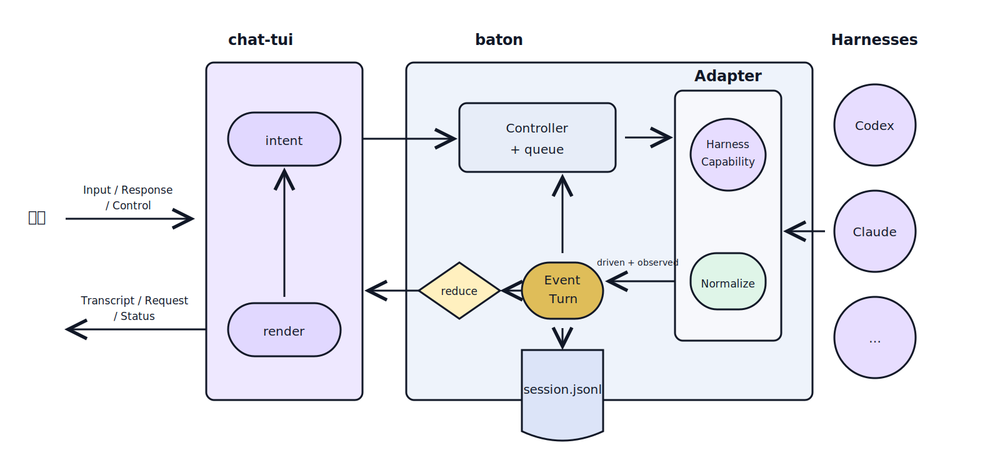

# baton 内核（kernel）

> 本文定义 baton 的**稳定内核**：少数核心概念 + 少数不变量 + 一条流水线 + 一份扩展契约。判据只有一条——**新增一个 harness 默认只改 `adapters/` + `harness/registry` + `harness/ids`（+ 或许一个新 capability 接口），不触碰 session / store-reduce / projection / chat-tui**。改动若渗进内核，通常说明"有个概念还没一等化"（见 §6）。内核并非冻结：当一个特性被多个 harness 共同印证，它也会演进——但改内核比改 adapter 贵一个量级，门槛见 §5。
>
> 内核之外的设计（产品定位、存储路径、外部会话纳管、@ 引用、里程碑）见 `design.md`；输入 / 输出 / 审批三轴的展开见 `user-input-lifecycle.md`、`harness-output-lifecycle.md`、`approval-lifecycle.md`；Adapter 契约的完整条款见 `harness-interaction-design.md`。

## 1. 核心概念

内核由六个概念承重。每个概念绑定一条不能被 harness 差异侵蚀的不变量。

| 概念 | 语义 | 绑定的不变量 |
|---|---|---|
| **BatonSession** | 用户拥有的持久逻辑历史，跨 harness 的唯一时间线 | 身份锚点：历史跟随 session，项目归属跟随发起 cwd（跨项目 fork = 同一段逻辑历史落到另一 cwd + 全新 HarnessSession）|
| **Event（信封）** | 最小 append-only 记录：归一字段 `payload` + 原始 wire `raw` | 事件流是**感知的唯一真相源**；UI / 崩溃恢复 / resume 全是它的 reduce/投影，无旁路通道 |
| **Turn** | 一段有始有终的 harness 活动（带 stopReason）| "谁发起"是属性（driven / observed），不是存在条件；**每个被 admit 的 turn 恰好收口一次** |
| **HarnessTarget** | Baton 配置与调度侧的一份具体 Harness 目标 | 执行位置与协议类型分离：`Controller` slot、原生 session 和同步水位按 target 隔离，不按 Harness 名称混用 |
| **Adapter + Capability** | harness 方言的**唯一**居所：小核心 `HarnessAdapter` + 可选能力 descriptor | 差异表达为"能力有无"，type-guard 发现、契约测试钉住；**内核永不 `if harness===`** |
| **Projection** | 纯函数：event reduce → 视图快照 | 只产展示形状；chat-tui 消费形状不消费语义；未变返回同引用（快照一致）|

HarnessSession 不在此表——它是某 HarnessTarget 启动出的原生执行状态、内核的实现细节：
baton 优先用 `harnessSessionId` 加速恢复，但它缺失只降级、不能阻止 BatonSession 续聊。
每次 create/resume 使用不可变 `HarnessLaunchSnapshot` 记录当时的 target、cwd、model 和 effort；
快照解释既有执行，后续配置变化不能回写它。

**ID 规则**：Baton 签发的 session / turn / message / tool call 等对象使用带前缀 ULID
（`bs_` / `hs_` / `t_` / `m_` / `tc_`），从第一天起稳定、可外部引用；HarnessTarget、
PluginInstance 等配置对象使用各自作用域内的稳定配置 ID。fork 复制的历史对象与源
**共享对象 ID**（git-branch 语义），跨会话引用以 `bs_ + 对象 ID` 消歧（why 见
`resume-fork.md`）。

## 2. 三条不变量

内核的正确性压在这三条上；违反任意一条，加 harness 就会渗进核心。

1. **单通道真相**：一切经 `event → append → broadcast → reduce → projection`。live 与 resume 是同一条 reduce 路径。不允许第二条投影通道（per-turn 回调曾是第二通道，导致 observed turn 的回复"只持久化、不投影"，重开会话才可见）。自愈也走这条：合成的终态事件重新进 `onAdapterEvent`，不直接改 state。由 `tests/harness-initiated-turn.test.ts` 的参数化契约测试钉住。

2. **终态封闭 + 悲观兜底**：内部状态是**封闭词表**，adapter 在边界把 harness 的开放 / UNSTABLE 字符串归一进来；**未知一律保守**（未知终态 → `failed` 不是 `completed`；未知 verdict → 不 finalize）。"悲观、绝不失声"是感知面的承重原则。

3. **核心无 harness 分支**：harness 差异只以 capability 有无出现在内核视野里。渲染层与存储层不出现 harness 分支；harness 私有形态留在信封 `raw`。归一是"最大公约数 + raw 保真"：形状统一，粒度差异不掩盖。

## 3. 内核流程：一条双向流水线

内核只有一条流水线，双向流动。observed turn、stall 自愈、审批闭环都是它的特例，不是另起的机制。

**开发次序：两个边界的形态先钉死，中间处理慢慢打磨。** 先定死用户侧的 I/O 形态（用户→baton：Input / Response / Control；baton→用户：render 投影——transcript / 浮层 / footer）和 harness 侧的 I/O 形态（harness→baton：归一 Event，含常规输出与 Request；baton→harness：capability 操作）。这两个边界一旦稳定，baton 的**中间处理**（Controller 调度、queue、reduce、projection）就能渐进重构而不惊动边界契约——接入方（chat-tui）与 harness（adapter）不被中间打磨波及。这也是内核纪律钉在**边界**（§4 扩展契约、§2 不变量）、而演进（§5）主要作用于中间与概念提升的原因。



两点要害：入站归一箭头标注的 `driven + observed`——`Adapter → event` 路径同时承载用户驱动与 harness 自发两种 turn，独立于是否有待决 Input（单通道真相，不变量 #1）；用户侧两种出站信号——Input 经 composer+queue 被调度成 turn，Response 在浮层作答、`refersTo` 某个 harness Request（Request↔Response 交互轴，见 §6）。

```text
控制（出站）  chat-tui intent
             → Controller（拥有 Input 生命周期，调度 driven turn）
             → Adapter（按 capability 映射 submit / steer / cancel / approve）
             → harness wire
感知（入站）  harness wire
             → Adapter 归一（→ 封闭词表，未知 fail-closed，保留 raw）
             → Event append → broadcast
             → reduce → Projection 快照
             → chat-tui 渲染
```

**Turn 生命周期**（内核心跳）：

- `admit`（Controller，driven turn）：出队即由 controller 落 `user_message` + `state_update(running)`——用户输入是 BatonSession 的事实，不等 harness 冷启动；driven turn 全局串行、finalize 推进队列。
- `observe`（adapter，observed turn）：harness 自发。adapter 在终态后的同一消息流上检测到新活动，铸新 turnId、以 `state_update(running, origin:"harness")` 开界、idle 收界；controller 只划界记账、投影，**不进队列**（它已在跑，调度它无意义、阻塞用户输入更是倒置）。全局串行约定据此收窄为：**driven turn 全局串行，observed turn 与其正交**。
- `terminal`（恰好一次）：adapter 在任何退出路径（正常 / wire error / 子进程退出 / transport close）都必须报告或合成一次 `state_update(idle)`；错误路径先发 `_baton_error_update`。重复 / 迟到的物理终态允许存在，controller 按 baton turn id 幂等 finalize。
- `setup`（harness 冷启动，turn 之外的活动窗口）：slot 创建 → open 完成之间，adapter 可能阻塞征询用户（hook trust / 登录确认）、拉模型目录、失败退出。setup 不自成 turn——其间的 request 事件一律归属**触发冷启动的 driven turn**（唯一事件入口按"是不是 request"补归属，不按 kind 特判）；setup 期间 adapter 自行启动的资源（子进程、探测 query）由 **adapter 负责清理**——open 未返回 ref 前 controller 无从 close，失败路径不清理即泄漏。
- `finalize`：落 turn-summary、推进队列（仅 driven）。

**自愈旁支**（harness 静默悬挂时）：stall 在事件流上被观测（L1，`_baton_stall_notice`）→ 若 adapter 声明 `Reconcilable` 则探权威快照（L2）→ 用修复事件结算被丢的 item 级终态 → 合成终态重新进同一条流水线。silence 是观察不是判决，权威探测应能 clear / refine 而非直接判死。

**审批闭环**（同一条流水线的专门子流程）：`permission_request` 事件 → PendingApproval（state → requires_action）→ 由**授权方**决策（用户在 TUI，或显式委托的 reviewer）→ **ApprovalReview 回执**（带自己的 id）append → projection 挂到目标 tool 卡。declined 是一等终态；委托状态对当前活跃 harness 可见。

## 4. 扩展契约：加一个 harness

`HarnessAdapter` 是内核唯一面向 harness 的接口（完整条款见 `harness-interaction-design.md`）：

```ts
interface HarnessAdapter {
  readonly harness: string;
  readonly capabilities: AdapterCapabilities;              // 可展示的能力 descriptor
  open(opts, sink: EventSink): Promise<HarnessSessionRef>;
  submit(ref, input: PromptInput): Promise<PromptReceipt>; // resolve 仅代表 admission 通过，不代表 turn 完成
  cancel(ref): Promise<void>;
  close(ref): Promise<void>;
}
```

**MUST**：

- 实现小核心 `HarnessAdapter`；把 wire 方言归一进 Event 信封并保 `raw`；未知终态按不变量 #2 保守收口。
- 可选能力（`Steerable` / `Reconcilable` / `ModelConfigurable` / …）**声明即必须实现**，由契约测试保证；不声明 = 优雅降级，绝不是核心分支。
- 经 `harness/registry`（Harness 定义 + adapter 工厂）+ `harness/ids`（无 SDK 身份目录：id + aliases）注册。

**MUST NOT**（默认边界；确需突破时走 §5 的演进门槛，不在此私自扩核心）：

- 为**单个** harness 的方言给 BatonSession / Turn / Event 核心加字段或分支；
- 开第二条投影通道；
- 让 harness 字符串越过 adapter 边界（封闭词表在此收口）；
- 静默持有审批授权（必须产生可见、带 id 的回执）。

**自检**：新增 harness 的 diff 只落在 `adapters/<harness>/` + `registry` + `ids`（+ 或许一个新 capability 接口）。一旦落进 `session/`、`store/reduce`、projection 语义或 chat-tui，先自问："这是这一家的方言，还是 ≥2 家的共性？"——前者归 adapter/`raw`，后者才按 §5 慎重提升内核。

## 5. 内核的演进规则

内核不是冻结的。BatonSession / Turn / Event 也会演进——但内核是所有 harness 与全部投影 / 存储的共同约束，改它比改一个 adapter 贵一个量级，因此要很慎重，有明确的门槛与方向。

**判据：默认下沉，共性才上浮。**

- **默认：单个 harness 的特性留在 adapter + `raw`**，或表达为一个 optional capability。一家有、别家没有的东西不进内核——否则内核长出只服务一家的字段，就退化成"harness 分支的联合体"，§2 不变量 #3 名存实亡。
- **提升触发：同一特性在 ≥2 个 harness 上独立出现**，说明它是这个问题域的普遍形状、而非某家方言——此时才把它归一进内核。cross-harness 证据是门槛，单家便利不是。
- **加法优先、语义封闭**：优先新增事件类型 / Turn 属性 / capability，尽量不改既有 `payload` 的既定含义——旧 `session.jsonl` 必须仍能 replay 出相同累计结果（§2 不变量 #1）。能用 optional capability 表达的，就不进核心必选。

**两个演进方向：**

1. **capability 毕业**：一个可选能力（如 `Steerable`）若被所有活跃 harness 支持、且成为交互刚需，可从"可选"升为"核心约定"。代价是新 harness 从此必须实现它、接入门槛随之抬高——所以非刚需不升。
2. **概念提升**：一个反复在投影 / 存储层打补丁的隐式概念，被确认为跨 harness 的普遍需求后，提升为一等内核概念。§6 列出各轴的一等概念，就是这条路径的落点。

**每次内核改动回答三问**：① 这是 ≥2 家的共性，还是一家的方言？② 能否用 optional capability 而非核心字段表达？③ 改完，旧事件流还能 replay 出相同结果吗？三问不全过，就先留在 adapter 层。

## 6. 各轴的一等概念

内核在每条轴上都要求一个"一等"的承载对象：隐式或泄漏的概念会让局部修复反复打补丁、扩展被迫改核心。四条轴的一等概念与其绑定规则——

- **输入轴 · Input**——用户输入是一等概念（身份即其 messageId），消费状态可查，统一 draft / queued / admitted / steer / recall。缺了它，"Esc + 第二条待决意图"这类时序本质不可判定（见 `user-input-lifecycle.md` S3）；有了它，recall / steer 从时序特例收敛为对同一实体的状态查询。用户信号共三型（同族不同落点）：**Input**（内容，驱动 turn）/ **Response**（内容，答复某 Request，就地解阻 pending）/ **Control**（无内容，命令 turn 生命周期，如 `interrupt`，out-of-band 打断且级联收口 pending Response）。

- **交互轴 · Request ↔ Response**——harness 阻塞征求用户（**Request**:`kind` = permission / choice / elicitation,**不限权限**）、用户经 request id `refersTo` 答复（**Response**,走统一 `respond()`）。与输入轴正交的第三根用户交互轴;Response 与 Input 同为"用户 → harness 信号",区别在 solicited（必关联一个 Request）。委托代批的审计回执 `ApprovalReview`（自带 `reviewId`、timeline 公民、多次决策各自成条不被覆盖）是 `Response{kind:permission}` 的委托叶子,非通名。详见 `harness-interaction-design.md` §3.5。

- **输出轴 · 封闭终态词表**——harness 的开放 / UNSTABLE 终态在 adapter 边界经统一原语收口到内部闭集，未知一律保守回落（不变量 #2）。闭合值进入事件流后 reduce / 投影不再面对未知；原始值留在 `raw`。反面参照 `StopReason`：有意保持开放（forward-compat 元数据）——turn 靠 `idle` 无条件收口、不依赖 reason 字符串，故无需封闭。判据是"未知会不会导致失声"，不是"凡开放皆封闭"。

- **展示轴 · outcome 与 tone 双轴**——展示态分两根正交轴：lifecycle/outcome（completed / failed / declined）与 tone/severity（warning…）。二者混进单一 union，会让"跑了但需留痕"与真实结果争用一个状态位、共用一个颜色 token，枚举随特性膨胀。此轴在 chat-tui 侧，是纯展示取舍。

## 7. References

- `design.md` — 内核之外的完整设计（定位、问题域、架构、存储、纳管、@、里程碑）
- `harness-interaction-design.md` — Adapter 契约完整条款（生命周期 / 能力 descriptor / admission）
- `user-input-lifecycle.md` / `harness-output-lifecycle.md` / `approval-lifecycle.md` — 输入 / 输出 / 审批三轴展开
- `resume-fork.md` — resume/fork 语义（fork = 同一段逻辑历史的复制）、会话锁与 crash recovery
